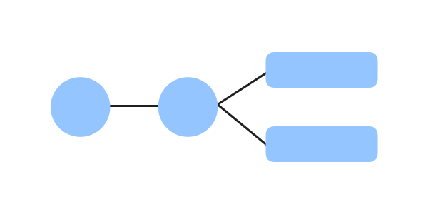

# Revo Name Specs

Current version: `<current-version>`

## Description

> Here you can describe the current success criteria of the *revo*. Success criteria are the requirements this *revo* needs to have in order achieve its purpose. Try to describe the criteria with a list that the team will review during the pull request.

## User path

> The user path is something you design. Here you can describe all the actions the user has to accomplish in order to fulfill the *revo* purpose. It should include actions, user roles and feature requirements.

*Please commit an image of the diagram, named `user-path.png`, in the directory of this document.*

### Components

> The list of the interface components that will implement the user path according to the success criteria.

#### Component A

#### Component B

## Wireframes

:warning: *In progress*

## Mockups

:warning: *In progress*
